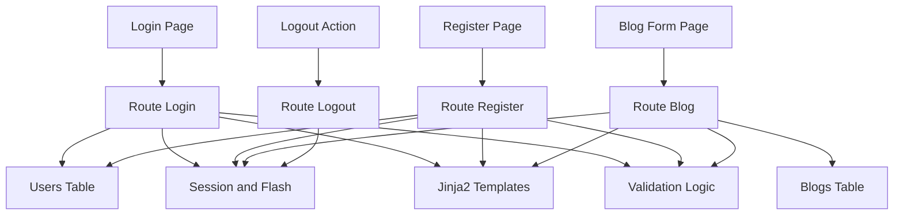

# 📝 BlogPostWebPage

A responsive web application to **create, read, update, and delete blog posts**, built using **Flask** and **PostgreSQL**. Ideal for personal blogging, company news pages, or content-driven sites.

---

## 🌟 Features

- User-friendly CRUD interface for blog posts
- Create, view list, read details, edit, and delete posts
- Clean, minimal design using HTML/CSS (optionally Bootstrap)
- Simple navigation and intuitive user experience
- Lightweight and easy to customize

---

## 🛠️ Technologies Used

| Technology       | Purpose                                              |
|------------------|------------------------------------------------------|
| **Flask**        | Web framework for building Python routes and views   |
| **Jinja2**       | Templating engine for HTML rendering                |
| **PostgreSQL**   | Relational database to store blog entries           |
| **psycopg2**     | Python adapter for PostgreSQL                       |
| **Bootstrap**    | Responsive, mobile-first CSS framework (optional)   |

---

### 📥 Installation

1. **Clone the repo**
   ```bash
   git clone https://github.com/Vibodharya-Jampale-Sathish/BlogPostWebPage.git
   cd BlogPostWebPage
---

## 🧠 Architecture

